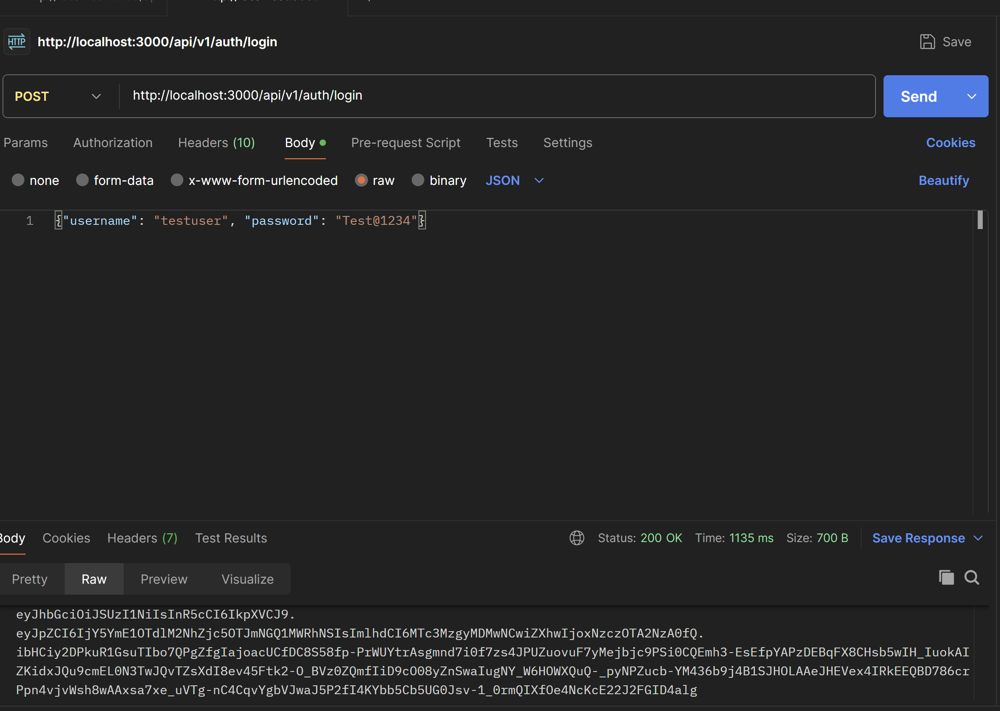
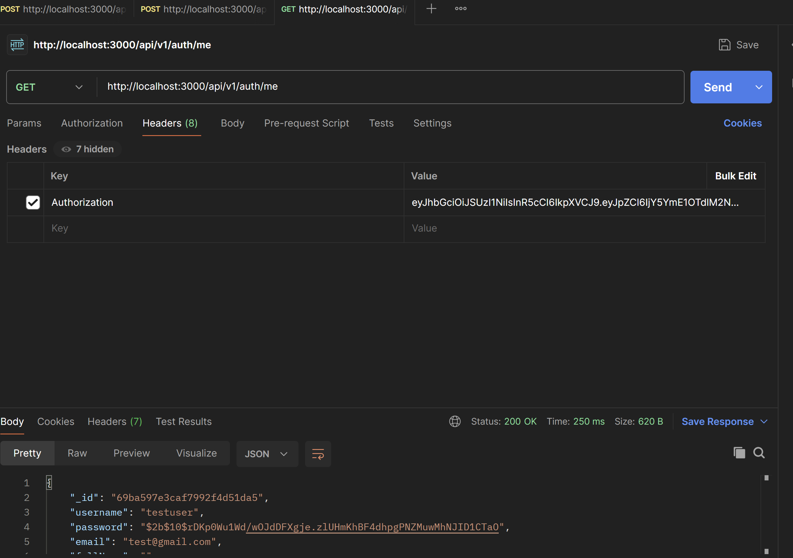
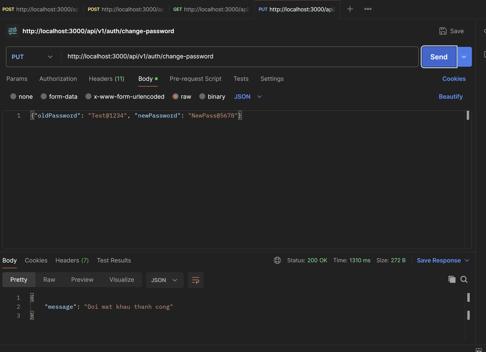

# API Documentation - NNPTUD-C4

## Base URL
```
http://localhost:3000/api/v1
```

---

## 1. Register

**Endpoint:** `POST /auth/register`

**Curl:**
```bash
curl -X POST http://localhost:3000/api/v1/auth/register \
  -H "Content-Type: application/json" \
  -d '{"username": "testuser", "password": "Test@1234", "email": "test@gmail.com"}'
```

**Body (JSON):**
```json
{
  "username": "testuser",
  "password": "Test@1234",
  "email": "test@gmail.com"
}
```

---

## 2. Login

**Endpoint:** `POST /auth/login`

**Curl:**
```bash
curl -X POST http://localhost:3000/api/v1/auth/login \
  -H "Content-Type: application/json" \
  -d '{"username": "testuser", "password": "Test@1234"}'
```

**Body (JSON):**
```json
{
  "username": "testuser",
  "password": "Test@1234"
}
```

**Response:** JWT Token (RS256)

### Kết quả trên Postman:



- **Status:** 200 OK
- **Time:** 1135 ms
- **Size:** 700 B
- **Response:** JWT token được ký bằng thuật toán RS256 (2048-bit RSA key)

---

## 3. Get Current User (/me)

**Endpoint:** `GET /auth/me`

**Yêu cầu:** Đăng nhập (gửi token trong Header Authorization)

**Curl:**
```bash
curl -X GET http://localhost:3000/api/v1/auth/me \
  -H "Authorization: <TOKEN>"
```

**Headers:**
| Key           | Value          |
|---------------|----------------|
| Authorization | `<JWT_TOKEN>`  |

**Response (JSON):**
```json
{
  "_id": "69ba597e3caf7992f4d51da5",
  "username": "testuser",
  "password": "$2b$10$...",
  "email": "test@gmail.com",
  "fullName": "",
  ...
}
```

### Kết quả trên Postman:



- **Status:** 200 OK
- **Time:** 250 ms
- **Size:** 620 B
- **Response:** Trả về thông tin user đang đăng nhập

---

## 4. Change Password

**Endpoint:** `PUT /auth/change-password`

**Yêu cầu:** Đăng nhập (gửi token trong Header Authorization)

**Curl:**
```bash
curl -X PUT http://localhost:3000/api/v1/auth/change-password \
  -H "Content-Type: application/json" \
  -H "Authorization: <TOKEN>" \
  -d '{"oldPassword": "Test@1234", "newPassword": "NewPass@5678"}'
```

**Headers:**
| Key           | Value          |
|---------------|----------------|
| Authorization | `<JWT_TOKEN>`  |

**Body (JSON):**
```json
{
  "oldPassword": "Test@1234",
  "newPassword": "NewPass@5678"
}
```

**Validate newPassword:**
- Không được để trống
- Tối thiểu 8 ký tự
- Ít nhất 1 chữ hoa
- Ít nhất 1 chữ thường
- Ít nhất 1 ký tự đặc biệt
- Ít nhất 1 chữ số

**Response thành công (JSON):**
```json
{
  "message": "Doi mat khau thanh cong"
}
```

**Response lỗi:**
| Trường hợp                          | Message                                    |
|-------------------------------------|--------------------------------------------|
| Mật khẩu cũ sai                     | `Mat khau cu khong dung`                   |
| Mật khẩu mới trùng mật khẩu cũ     | `Mat khau moi khong duoc trung mat khau cu`|
| Mật khẩu mới không đủ mạnh         | `mat khau moi phai co it nhat 8 ki tu...`  |
| Chưa đăng nhập                      | `ban chua dang nhap`                       |

### Kết quả trên Postman:



- **Status:** 200 OK
- **Time:** 1310 ms
- **Size:** 272 B
- **Response:** `{"message": "Doi mat khau thanh cong"}`

---

## Ghi chú: JWT RS256

Dự án sử dụng thuật toán **RS256** (RSA 2048-bit) để ký và xác thực JWT:

- **Sign (ký token):** Sử dụng `private.pem` (private key) khi login
- **Verify (xác thực token):** Sử dụng `public.pem` (public key) trong middleware CheckLogin
- **Ưu điểm:** An toàn hơn HS256 vì private key chỉ server giữ, public key có thể chia sẻ để verify mà không lộ secret
